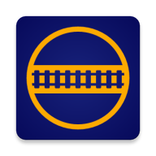
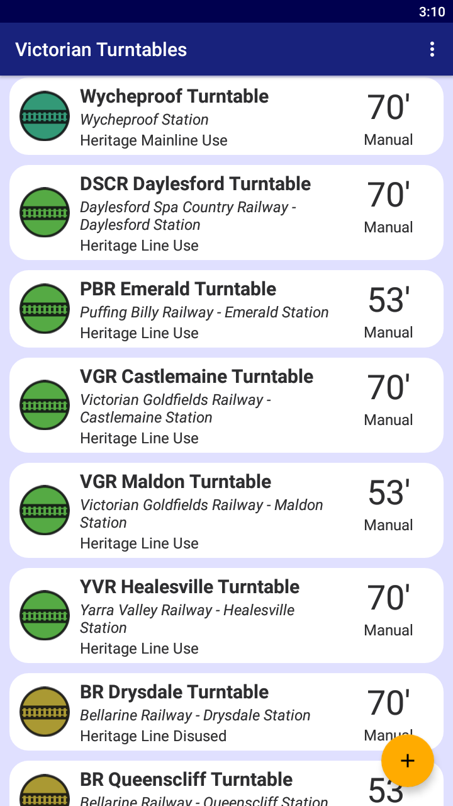
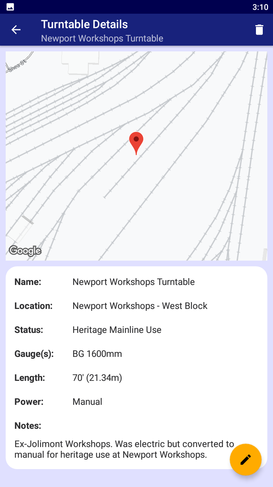
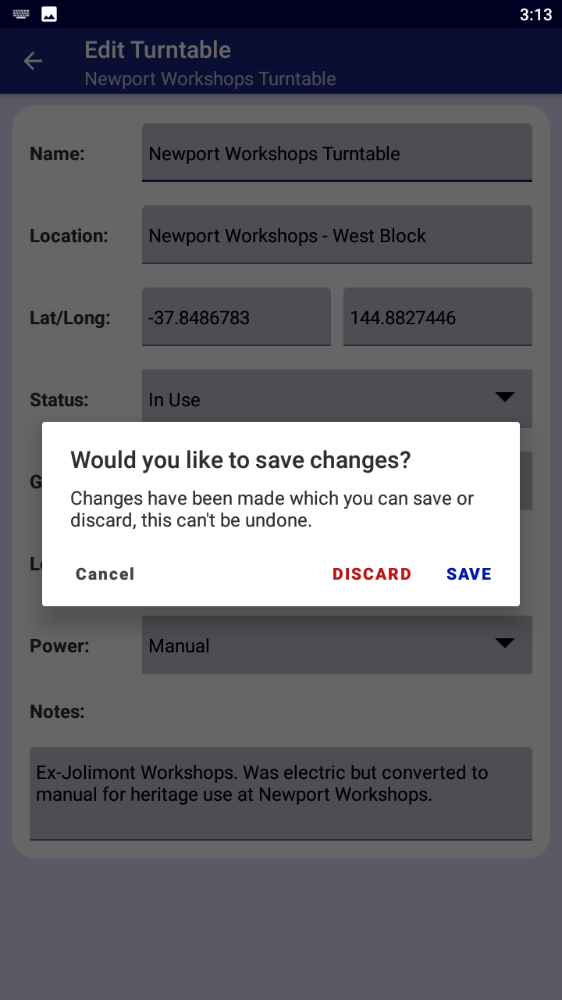

# Victorian Turntables App v1.0
**Created by Freya-The-Goddess**<br/>
*Custom App project for Software Development for Mobile Devices (COS30017)*<br/>
*Swinburne University - Semester 2 2022*<br/>


## Project Summary
This project was the final assignment for Software Development for Mobile Devices (SDMD) which I studied at Swinburne in Semester 2 of 2022.
My custom app project is a create, read, update, delete (CRUD) app for storing and editing information about railway turntables in Victoria. 
I already had an existing dataset in the form of a .csv file with a list of surviving turntables and related metadata like location, status, rail gauge turntable length, etc.

## Links
[App Design & Development Report](https://docs.google.com/document/d/1PXAGwHWzJsfavbByvOkxXMZ5sWidsCDioXy7Awl5eVM) <br/>
[App Video](https://youtu.be/wZ-Eif2Bs_k) <br/><br/>
[](https://youtu.be/wZ-Eif2Bs_k) <br/>

## Screenshots
<br/>

## Railway Turntables - Background Information
Turntables are an important piece of railway infrastructure which allows locomotives to be turned to face the other direction.
A rotatable steel bridge with railway tracks is balanced in the centre by a pivot or bearing, with the turntable usually placed inside a pit so the tracks are level with the surrounding ground.
When the weight of the locomotive is balanced over the pivot the turntable can be easily rotated by hand with as few as one person. 
Some later turntables were electrically powered to reduce required man power and speed up locomotive turning, especially in depots where many locos would be turned a day. 
A handful of niche examples were also powered by alternative methods including petrol, diesel and pneumatic air power.
<br/>

The ability to turn a locomotive was especially important in the days of steam engine, when leading funnel-end first provided much greater visibility and comfort for the driver and fireman than leading tender first. 
This also applied to early diesel locomotives, which often had only one driver’s cab and leading short-hull first had better visibility than leading long-hull first. 
However modern diesel and electric locomotives often have a driver’s cab at either end so under normal circumstances don't need to be turned. 
For this reason many turntables fell into disuse and disrepair with many eventually being removed and scrapped.
<br/>

A number of railway turntables in Victoria have survived to the present and a handful are still in use at locomotive depots, freight terminals and maintenance facilities. 
VicTrack and V/Line also maintain a number of turntables across country Victoria for use by heritage and tourist special services, sometimes run by restored steam locomotives. 
There are also a number of turntables located on tourist railways for private line operations. 
Many of the surviving turntables are now heritage listed and preserved as part of railway history. 
I believe recording and documenting these parts of history is important and my custom app will allow me to keep a record of the surviving turntables that can be updated and amended.
<br/>

## Google Maps API Key Instructions
If you want to build this app from the source code you will need a Google Maps API key to make the map fragment work. Instructions to get one from Google Developer Console can be found here: [Using API Keys](https://developers.google.com/maps/documentation/android-sdk/get-api-key)
<br/>
You will need to modify the generated `local.properties` file to add your API key as a project variable like so: <br/>
```
MAPS_API_KEY=AIz...`
```