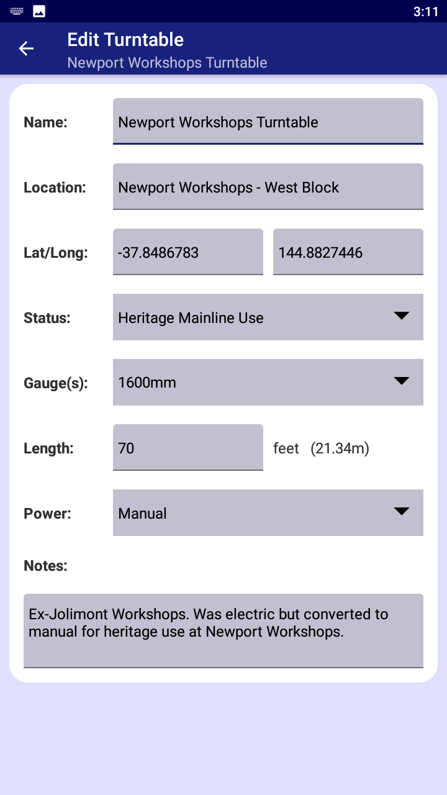

# Victorian Turntables App v1.0
***Custom App for COS30017 - Semester 2 2022***<br/>
**Freya Corlis-Richards**<br/>


## Links
[App Design Report](https://docs.google.com/document/d/1PXAGwHWzJsfavbByvOkxXMZ5sWidsCDioXy7Awl5eVM) <br/>
[App Video](https://youtu.be/wZ-Eif2Bs_k) <br/>

## Screenshots


## Google Maps API Key Instructions
If you want to build this app from the source code you will need a Google Maps API key to make the map fragment work. Instructions to get one from Google Developer Console can be found here: [Using API Keys](https://developers.google.com/maps/documentation/android-sdk/get-api-key) <br/>
You will need to modify the generated `local.properties` file to add your API key as a project variable like so: <br/>
```
MAPS_API_KEY=AIz...`
```